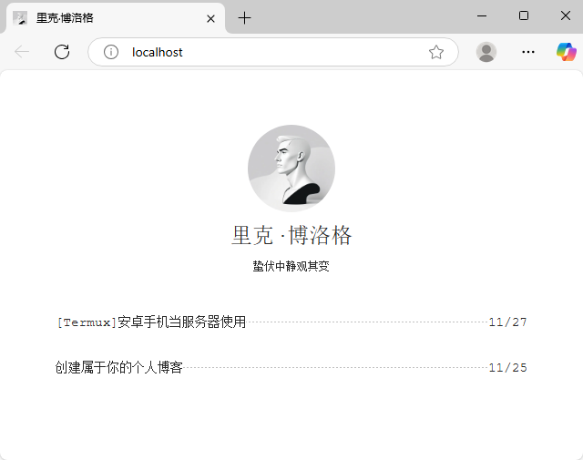

# Leek.blog



### 使用指南

GitHub静态博客生，使用Actions构建部署的单页程序。功能简单，使用较为方便。
界面简洁明了，使用Markdown语法生成静态页面。将md文件上传至posts文件夹内自动更新网站内容。
`.conf` 文件支持修改网站名称，网站签名，网站描述，页脚版权。

### 文章发布说明

文章请使用md文件存储，文件内前5行内容需要严格按照格式书写。
```
1. # 文章标题
2. 
3. 2024-11-25
4. 
5. 文章描述
```
第一行为标题，可以与文件名不同。

第三行为时间，支持"YYYY MM DD"格式，分隔符可以用`'-'` 和 `'/'` 。

第五行为文章描述，head中的description获取的就是第五行的文字，可以忽略。

### 目录结构

```
.github/
    workflows/
        index.yml
asset/
    avatar.jpg
    favicon.png
    main.css
    page.css
pages/
posts/
.conf/
.gitignore
CNAME
README.md
```

### 其他

我的邮箱：[proton.me](leekblog@proton.me "proton.me匿名邮箱")

软件开源许可：MIT